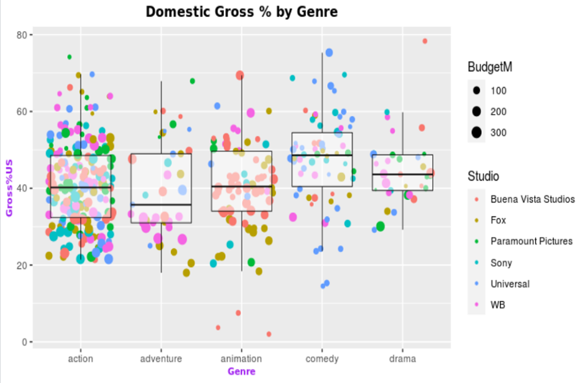

### Evaluation U2
> before we start coding The first thing we have to do and take into account the requirements and the scope of the problem
> it is to take a look at our data set, it is to analyze the data to see the nature of these, if they imply or not.
> After this we start our Dataset
> Method 1: Select the file manually
```R
stats <- read.csv(file.choose())
stats
```
> Method 2: Set the working directory and read data
```R
getwd()
setwd("/home/karen/Documentos/Mineriadedatos/DataMining/Datasets/")
getwd()
movies <-  read.csv("Project-Data.csv")
colnames(movies) 
```
> We indicate which columns are the ones we will use from our dataset
> Genre, Studios, Budget, Groos% US respectively
```R
movies <- movies [c(3,6,8,18)]
```

> we rename columns
```R
colnames(movies) <- c("Genre", "Studio", "BudgetM", "GrossUS")
```
> It will be necessary to filter by genres, as the problem suggests that the managers of the website of
> Film critics are interested only interested in action, adventure, animation and comedy
> we will assign movies only those that meet the logical condition movies $ Genre == ...
>movies<-movies[movies$Genre=="action"|movies$Genre=="adventure"|movies$Genre=="animation"|movies$Genre=="comedy"|movies$Genre=="drama",]
> Therefore they are also specifically interested in studios such as Buena Vista Studios, Fox
> Paramount Pictures, Sony, Univerdal, WB
```R
movies<-movies[((movies$Genre=="action"|movies$Genre=="adventure"|movies$Genre=="animation"|movies$Genre=="comedy"|movies$Genre=="drama") & (movies$Studio=="Buena Vista Studios" | movies$Studio=="Fox" | movies$Studio=="Paramount Pictures"|movies$Studio=="Sony" |movies$Studio=="Universal" |movies$Studio=="WB")), ]
```

> We will visualize our dataset
```R
head(movies) #Primeros Datos 
tail(movies) #Ultimos Datos
str(movies) #Estructura
summary(movies) #Resumen
```
> we import the ggplot2 library to graph and use aesthetics
```R
library(ggplot2)
```

> Each color in the chart will be determined by Studio and Size by BudgetMIlllions
> We assign movies to our variable u, we determine that x will be for Genere when y
> will be for y = "Gross% US" the color will be determined by R and the size = BudgetMillions
```R
u <- ggplot(movies, aes(x=Genre, y=GrossUS,
                        color=Studio, size=BudgetM))
```
> box diagram
```R
u + geom_boxplot()  
```
> overlay all points for that group on each box plot to get an idea of ​​the sample size
> This can be accomplished by adding the geom_jitter
```R
u +  geom_jitter() + geom_boxplot(size=0.3,color="Black") 
```

> We format our box diagram
```R
u + geom_jitter(shape=20) + geom_boxplot(size=0.3,alpha=0.5,color="Black",outlier.shape = NA)+
  theme(
  plot.title = element_text(family="Chandas",color="Black", size=12, face="bold", hjust = 0.5),
  axis.title.x = element_text(family="Chandas",color="purple", size=8, face="bold"),
  axis.title.y = element_text(family="Chandas",color="purple", size=8, face="bold")
)  +  ggtitle("Domestic Gross % by Genre") + ylab("Gross%US") 
```
> By default, the outliers coincide with the one in the table. Use outlier.shape to override
> outlier.colour, outlier.shape, outlier.size: the color, shape, and size of the peripheral points

