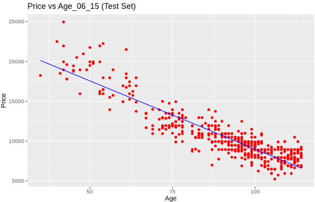

## PRACTICE 1: simpleLinearRegression
> Template for the previous data processing
> Import the dataset
```R
getwd()
setwd("/home/karen/Documentos/data/SimpleLinearRegression")
getwd()
dataset <- read.csv('Toyota_SimpleReg.csv')
View(dataset)
```

> we add the seed that helps us to give alertness
> Next we divide the data set into the training and test sets.
> First, we install the "caTools" package that contains the necessary tools;
```R
library(caTools)
```
> after establishing a seed that will randomize the split strategy
```R
set.seed(123)
```
> we apply the division function on the Price columns that will mark each line as TRUE or FALSE.
> Then, we extract from the dataset two disjoint and complementary matrices training_set
```R
split <- sample.split(dataset$Price, SplitRatio = 2/3)
training_set <- subset(dataset, split == TRUE)
```
> and test_set according to these flags.
```R
test_set <- subset(dataset, split == FALSE)
```
> Applying a regression on these data implies obtaining the straight line that best fits the relationship
> existing between the independent variable and the dependent variable. To do this, we are going to create a regressor
> making use of the lm function of the stats package
```R
regressor = lm(formula = Price ~ Age_06_15,
               data = dataset)
```
> The first argument of lm is the formula dependent variable ~ independent variable. The second argument indicates the data set that will be used to build the model.
> Once the regressor is created, we can explore the results and quality of the adjustment using the summary function:
```R
summary(regressor)
```
> Predict the results of the test set
```R
y_pred = predict(regressor, newdata = test_set)
```

> Viewing the results of the training set
```R
library(ggplot2)
ggplot() +
  geom_point(aes(x=training_set$Age_06_15, y=training_set$Price),
             color = 'red') +
  geom_line(aes(x = training_set$Age_06_15, y = predict(regressor, newdata = training_set)),
            color = 'blue') +
  ggtitle('Salary vs Experience (Training Set)') +
  xlab('Years of experience') +
  ylab('Salary')
```


> Viewing the results of the training set
```R
ggplot() +
  geom_point(aes(x=test_set$Age_06_15, y=test_set$Price),
             color = 'red') +
  geom_line(aes(x = training_set$Age_06_15, y = predict(regressor, newdata = training_set)),
            color = 'blue') +
  ggtitle('Salary vs Experience (Test Set)') +
  xlab('Years of experience') +
  ylab('Salary')
  ```
  
  
  
### Practice 3

> Select the file

```
stats <- read.csv(file.choose())
stats
```

> Set working directory and read data

```
getwd()
setwd('/home/davidmtz/Escritorio/JCROMERO/DataMining/Datasets')
getwd() 
dataset <- read.csv('50_Startups.csv')

```

> Categorical data
```
dataset$State = factor(dataset$State, levels = c('New York', 'California', 'Florida'), labels = c(1,2,3))
dataset
```
> Select test and training

```
library(caTools)
set.seed(123)
split <- sample.split(dataset$Profit, SplitRatio = 0.8)
test <- dfset(dataset, split == FALSE)
training <- dfset(dataset, split == TRUE)
```


> Atomation BackwardElimination Function

```
backwardElimination <- function(x, sl) {
  numVars = length(x)
  for (i in c(1:numVars)){
    regressor = lm(formula = Profit ~ ., data = x)
    maxVar = max(coef(summary(regressor))[c(2:numVars), "Pr(>|t|)"])
    if (maxVar > sl){
      j = which(coef(summary(regressor))[c(2:numVars), "Pr(>|t|)"] == maxVar)
      x = x[, -j]
    }
    numVars = numVars - 1
  }
  return(summary(regressor))
}
```

```
SL = 0.05
training
backwardElimination(training, SL)
```

  
### PRACTICE 4: LogisticRegression

> Template for the previous data processing
> Import the dataset
```R
getwd()
setwd("/home/karen/Documentos/Mineriadedatos/DataMining/MachineLearning/LogisticRegression")
getwd()
```
> Importing the dataset
```R
dataset <- read.csv('Social_Network_Ads.csv')
dataset <- dataset[, 3:5]
```
> Splitting the dataset into the Training set and Test set
> Install.packages('caTools')
```R
library(caTools)
set.seed(123)
split <- sample.split(dataset$Purchased, SplitRatio = 0.75)
training_set <- subset(dataset, split == TRUE)
test_set <- subset(dataset, split == FALSE)
```
> Feature scaling
```R
training_set[, 1:2] <- scale(training_set[, 1:2])
test_set[, 1:2] <- scale(test_set[, 1:2])
```
> Fitting Logistic Regression to Training set
```R
classifier = glm(formula = Purchased ~ .,
                 family = binomial,
                 data = training_set)
```

> Predicting the Test set results
```R
prob_pred = predict(classifier, type = 'response', newdata = test_set[-3])
prob_pred
y_pred = ifelse(prob_pred > 0.5, 1, 0)
y_pred
```
> Making the Confusion Metrix
```R
cm = table(test_set[, 3], y_pred)
cm
```
>
```R
library(ggplot2)
ggplot(training_set, aes(x=EstimatedSalary, y=Purchased)) + geom_point() + 
  stat_smooth(method="glm", method.args=list(family="binomial"), se=FALSE)

ggplot(training_set, aes(x=Age, y=Purchased)) + geom_point() + 
  stat_smooth(method="glm", method.args=list(family="binomial"), se=FALSE)

ggplot(test_set, aes(x=EstimatedSalary, y=Purchased)) + geom_point() + 
  stat_smooth(method="glm", method.args=list(family="binomial"), se=FALSE)

ggplot(test_set, aes(x=Age, y=Purchased)) + geom_point() + 
  stat_smooth(method="glm", method.args=list(family="binomial"), se=FALSE)
```
> Visualization the Training set result


> Visualization the Training set result


```R
library(ElemStatLearn)
set = training_set
X1 = seq(min(set[, 1]) - 1, max(set[, 1]) + 1, by = 0.01)
X2 = seq(min(set[, 2]) - 1, max(set[, 2]) + 1, by = 0.01)
grid_set = expand.grid(X1, X2)
colnames(grid_set) = c('Age', 'EstimatedSalary')
prob_set = predict(classifier, type = 'response', newdata = grid_set)
y_grid = ifelse(prob_set > 0.5, 1, 0)
plot(set[, -3],
     main = 'Logistic Regression (Training set)',
     xlab = 'Age', ylab = 'Estimated Salary',
     xlim = range(X1), ylim = range(X2))
contour(X1, X2, matrix(as.numeric(y_grid), length(X1), length(X2)), add = TRUE)
points(grid_set, pch = '.', col = ifelse(y_grid == 1, 'springgreen3', 'tomato'))
points(set, pch = 21, bg = ifelse(set[, 3] == 1, 'green4', 'red3'))
```

> Visualising the Test set results
```R
library(ElemStatLearn)
set = test_set
X1 = seq(min(set[, 1]) - 1, max(set[, 1]) + 1, by = 0.01)
X2 = seq(min(set[, 2]) - 1, max(set[, 2]) + 1, by = 0.01)
grid_set = expand.grid(X1, X2)
colnames(grid_set) = c('Age', 'EstimatedSalary')
prob_set = predict(classifier, type = 'response', newdata = grid_set)
y_grid = ifelse(prob_set > 0.5, 1, 0)
plot(set[, -3],
     main = 'Logistic Regression (Test set)',
     xlab = 'Age', ylab = 'Estimated Salary',
     xlim = range(X1), ylim = range(X2))
contour(X1, X2, matrix(as.numeric(y_grid), length(X1), length(X2)), add = TRUE)
points(grid_set, pch = '.', col = ifelse(y_grid == 1, 'springgreen3', 'tomato'))
points(set, pch = 21, bg = ifelse(set[, 3] == 1, 'green4', 'red3'))
```


### Practice 5

> Select the file

```
stats <- read.csv(file.choose())
stats
```

> Set working directory and read data

```
getwd()
setwd('/home/davidmtz/Escritorio/JCROMERO/DataMining/Datasets')
getwd() 
dataset = read.csv('Social_Network_Ads.csv')
dataset = dataset[3:5]
```

> The target feature is encoded as a factor to have columns at 0 and 1.

```
dataset$Purchased = factor(dataset$Purchased, levels = c(0, 1))
```


> Select test and training

```
install.packages ('caTools')
library(caTools)
set.seed(123)
split = sample.split(dataset$Purchased, SplitRatio = 0.75)
test <- dfset(dataset, split == FALSE)
training <- dfset(dataset, split == TRUE)
```

> take the columns except the third

```
training[-3] = scale(training[-3])
test[-3] = scale(test[-3])
```

> SVM training 

```
install.packages ('e1071')
# Changed from "Linear" to "polynomial"
library(e1071)
classifier = svm(formula = Purchased ~ .,
                 data = training_set,
                 type = 'C-classification',
                 kernel = 'polynomial')
```

> Generate  Predict test whit predict() function

```
y_pred = predict(classifier, newdata = test[-3])
y_pred
```

> Create Confusion matrix

```
cm = table(test[, 3], y_pred)
cm
```


> Display of training data results

```
library(ElemStatLearn)
set = training
X1 = seq(min(set[, 1]) - 1, max(set[, 1]) + 1, by = 0.01)
X2 = seq(min(set[, 2]) - 1, max(set[, 2]) + 1, by = 0.01)
grid_set = expand.grid(X1, X2)
```

```
colnames(grid_set) = c('Age', 'EstimatedSalary')
y_grid = predict(classifier, newdata = grid_set)
plot(set[, -3],

     main = 'SVM (Training)',
     xlab = 'Age', ylab = 'Estimated Salary',
     xlim = range(X1), ylim = range(X2))

contour(X1, X2, matrix(as.numeric(y_grid), length(X1), length(X2)), add = TRUE)
points(grid_set, pch = '.', col = ifelse(y_grid == 1, 'springgreen3', 'tomato'))
points(set, pch = 21, bg = ifelse(set[, 3] == 1, 'green4', 'red3'))
```

> Generate Test Result

```
library(ElemStatLearn)
```

```
set = test
X1 = seq(min(set[, 1]) - 1, max(set[, 1]) + 1, by = 0.01)
X2 = seq(min(set[, 2]) - 1, max(set[, 2]) + 1, by = 0.01)
grid_set = expand.grid(X1, X2)

```
```
colnames(grid_set) = c('Age', 'EstimatedSalary')
y_grid = predict(classifier, newdata = grid_set)
plot(set[, -3], main = 'SVM (Test)',
     xlab = 'Age', ylab = 'Estimated Salary',
     xlim = range(X1), ylim = range(X2))

contour(X1, X2, matrix(as.numeric(y_grid), length(X1), length(X2)), add = TRUE)
points(grid_set, pch = '.', col = ifelse(y_grid == 1, 'springgreen3', 'tomato'))
points(set, pch = 21, bg = ifelse(set[, 3] == 1, 'green4', 'red3'))
```


### Practice 6


> Confusion Matrix
```
cm = table(test_set[, 2], y_pred)
cm
```

> Set Training results

```
library(ElemStatLearn)
set = training
X1 = seq(min(set[, 1]) - 1, max(set[, 1]) + 1, by = 0.01)
X2 = seq(min(set[, 1]) - 1, max(set[, 1]) +1, by = 0.01)
grid_set = expand.grid(X1, X2)
colnames(grid_set) = c('x', 'y')
y_grid = predict(classifier, newdata = grid_set, type = 'class')
plot(set[, -3],
     main = 'Decision Tree Classification (Training)',
     xlab = 'x', ylab = 'y',
     xlim = range(X1), ylim = range(X2))
contour(X1, X2, matrix(as.numeric(y_grid), length(X1), length(X2)), add = TRUE)
points(grid_set, pch = '.', col = ifelse(y_grid == 1, 'springgreen3', 'tomato'))
points(set, pch = 21, bg = ifelse(set[, 2] == 1, 'green4', 'red3'))
```

> Generate Test results

```
library(ElemStatLearn)
set = test
X1 = seq(min(set[, 1]) - 1, max(set[, 1]) + 1, by = 0.01)
X2 = seq(min(set[, 1]) - 1, max(set[, 1]) + 1, by = 0.01)
grid_set = expand.grid(X1, X2)
colnames(grid_set) = c('x', 'y')
y_grid = predict(classifier, newdata = grid_set, type = 'class')
plot(set[, -3], main = 'Decision Tree Classification (Test)',
     xlab = 'Age', ylab = 'Estimated Salary',
     xlim = range(X1), ylim = range(X2))
contour(X1, X2, matrix(as.numeric(y_grid), length(X1), length(X2)), add = TRUE)
points(grid_set, pch = '.', col = ifelse(y_grid == 1, 'springgreen3', 'tomato'))
points(set, pch = 21, bg = ifelse(set[, 2] == 1, 'green4', 'red3'))
```

> plot classifier

```
plot(classifier)
text(classifier)
```

