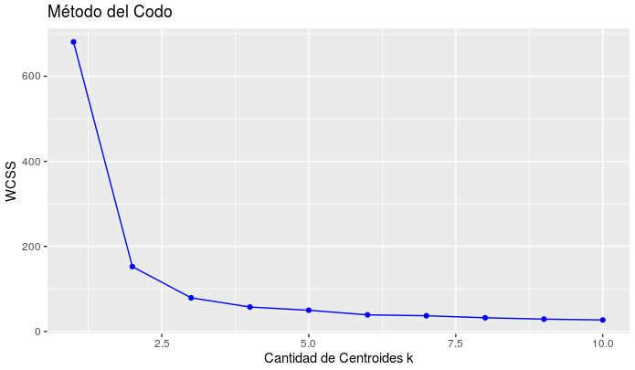
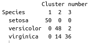

# Exam Unit 3


> Load and analyze the data set Load the data stored in csv format as a DataFrame.
```
getwd()
setwd("/home/karen/Escritorio/Programas/Examen/iris")
getwd()
dataset = read.csv('iris.csv')
```

> View the Dataset
```
head(dataset)
```

> Indicate how many classes we get from species 
```
dataset.class<- dataset[,"species"]
```

> We will use the quantitative columns alone, since K-means
> is a distance based algorithm
```
dataset = dataset[1:4]
head(dataset)
```

> Set the seed
```
set.seed(6)
```

> Using the "elbow method" d to find the optimal number of groups (the optimal number of centroids k)
> based on within the sum of squares of the cluster
```
wcss = vector()
```

> calculated the WCSS values based on the amount of centroids k
```
for (i in 1:10) wcss[i] = sum(kmeans(dataset, i)$withinss)
```

> plotting

```
ggplot() + geom_point(aes(x = 1:10, y = wcss), color = 'blue') + 
  geom_line(aes(x = 1:10, y = wcss), color = 'blue') + 
  ggtitle("Método del Codo") + 
  xlab('Cantidad de Centroides k') + 
  ylab('WCSS')
```



> Set K-Means to the dataset
```
set.seed(29)
```

> Finally, we can apply the algorithm to our data set with the quantity of k selected with centers = 3
```
kmeans = kmeans(x = dataset, centers = 3)
```

> We visualize inertias
```
names(kmeans) #contenido del objeto
kmeans$totss #inercia total
kmeans$betweenss #inercia entre grupos entre mas alta mejor
kmeans$withinss #inercia dentro de los grupos 1 para cada uno
kmeans$tot.withinss #inercia dentro de los grupos total la suma de inercias , preferentemente menor
```

> Let's see the result of the grouping:
```
y_kmeans = kmeans$cluster
```

> we see how the observations have been assigned to the different closters: observation 1 to 1, 3 to 2
```
y_kmeans
```


> Confusion matrix
```
table(dataset.class,kmeans$cluster,dnn=c("Species","Cluster number"))
```



> Viewing the clusters
```
library(cluster)
clusplot(dataset,
         y_kmeans,
         lines = 0,
         shade = FALSE,
         color = TRUE,
         labels = 4,
         plotchar = TRUE,
         span = TRUE,
         main = paste('Clusters of iris'),
)
```


> Customize upper panel
```
upper.panel<-function(x, y){
  points(x,y, pch=19, col=c("red", "green3", "blue")[dataset.class])
  r <- round(cor(x, y), digits=2)
  txt <- paste0("R = ", r)
  usr <- par("usr"); on.exit(par(usr))
  par(usr = c(0, 1, 0, 1))
  text(0.5, 0.9, txt)
}
```
```
pairs(dataset, main="Data (Iris -- 3 Especies",pch = 21, bg = c("red", "green3","blue")[dataset.class])
```

